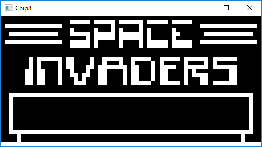
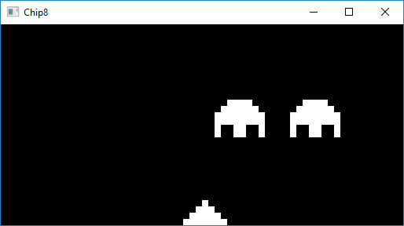
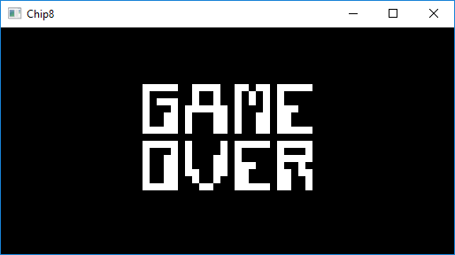
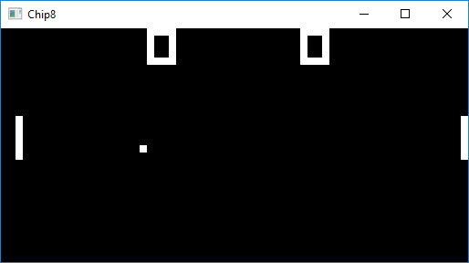
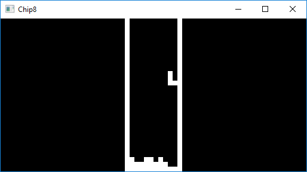
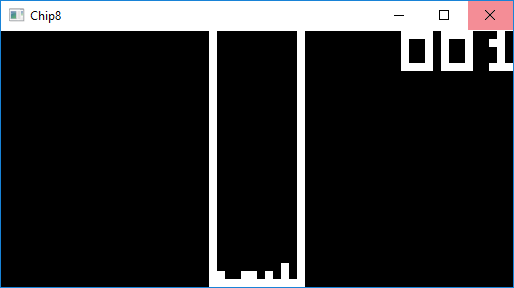

# Chor
Chip 8 emulator written in Rust using **piston** for the graphics.

## Space Invaders

#### Controls
```
W - Start game

Q - Move Left
W - Shoot
E - Move Right
```

<p align="center">






</p>

## Pong

#### Controls
```
Left Player
Q - Down
2 - Up

Right Player
X - Down
Z - Up
```

<p align="center">



</p>

## Tetris

#### Controls

```
R - Down
W - Left
E - Right
Q - Counter clock-wise rotation
```

<p align="center">





</p>

## Usage

```sh
$ cargo run [Chip 8 Game Rom]
```
